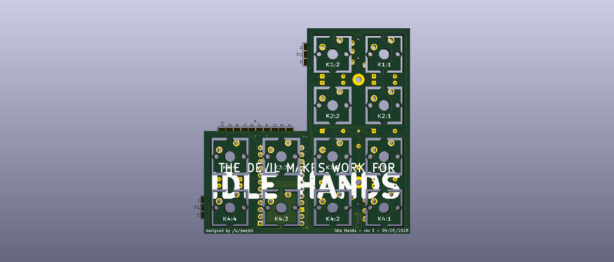

For Idle Hands is a 6x4x2 key ortholinear split keyboard PCB.

The goal of this project is to build a Let's Split keyboard clone from sub-100x100mm PCB boards.:

* Designed to be easy to build with minimal soldering experience.
* Switch plate cutouts in the PCB so the same PCB can also be used as a switch plate.
* Serial communication over a TRRS cable.
* Single sided PCB, so both halves of the keyboard are identical.

# Bill of Materials (BOM)

* 8 PCBs, 4 for components and 4 as switch plates.
* 48 MX compatible switches.
* 48 1n4148 diodes.
* 2 Pro Micro controllers with headers or DIP sockets.
* 2 PJ320A 3.5mm TRRS jacks.
* TRRS cable and micro USB cable.
* 8 2M standoffs (12mm, depending on required height)
* 16 2M screws
* 48 MX compatible key caps.

## Tools

* Hacksaw blade or similar
* Flat edged file or sanding paper
* Soldering iron and solder

# Ordering PCBs

PCBs can be manufactuered by a variety of online PCB fabricators. You can use [PCBShopper](https://pcbshopper.com/) to search for the best price.

The zip file in the gerber directory contains the gerber files your fabricator will need to make the PCB [for-idle-hands.zip](https://github.com/peej/for-split-keyboard/blob/master/gerber/for-idle-hands.zip) PCB.

When uploading the gerber zip files, use the default PCB settings. The plate PCB thickness should be 1.6mm for the switches to snap into the plate securely.

# Construction

* You will need 8 PCBs.
* If you are using the 6x4x2 layout, carefully cut the bottom row of switch footprints from the 4 PCBs.
* Use the hacksaw blade to remove the 4 support screw holes from the 2 component PCBs.
* Use a hacksaw blade to remove the cutouts for the switch plate PCBs.
* Solder the diodes onto the underside of each PCB.
* Solder on the Pro Micro headers (or a 24 pin DIP socket) onto the underside of each PCB, do not solder on the Pro Micros yet.
* Solder the PJ320A TRRS sockets onto the underside of each PCB.
  * There are 2 positions per board, use the right position on the left hand PCB and the left position on the right hand PCB.
  * Ensure that the pins will not foul the placement of the switches and still allow the switches to sit flat on the PCB.
  * You may need to slightly bend the pins inwards away from the switch footprint.
* Insert the switches into the plate and then into the top of the PCBs.
  * Insert all the switches and ensure that the pins of each switch are correctly coming through the board and are not bent under the PCB.
  * The top switch that sits underneath the Pro Micro can be inserted in either a north or south facing orientation. North facing helps to prevent it shorting on the Pro Micro components.
* Solder all the switch pins.
* Solder on the Pro Micros, ensure that you get them the correct way around, the chip side should be face down towards the PCB.
* Attach the standoffs to the plate PCB with the screws.
* Connect the halves together with the TRRS cable.
* Flash both Pro Micros with the firmware, see the [QMK documentation](http://qmk.fm/) on how to build and flash the firmware.
